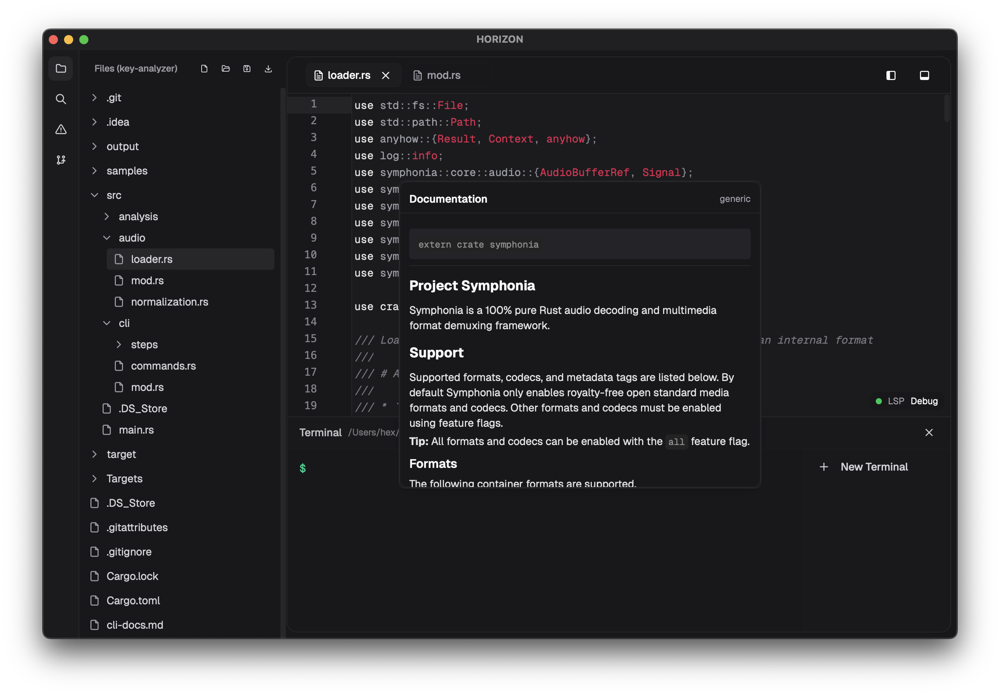

# Horizon


<div align="center">

> ⚠️ **Note:** This project is currently under active development and may contain bugs or incomplete features. Use at your own risk.

[](https://opensource.org/licenses/MIT)
[](https://tauri.app)
[](https://reactjs.org)
[](https://www.typescriptlang.org)
[](https://tailwindcss.com)
[](https://codemirror.net)

[](https://github.com/66HEX/horizon/stargazers)
[](https://github.com/66HEX/horizon/network/members)
[](https://github.com/66HEX/horizon/issues)
[](https://github.com/66HEX/horizon/pulls)

[](https://github.com/66HEX/horizon/releases)
[](https://github.com/66HEX/horizon/releases)
[](https://github.com/66HEX/horizon/releases/latest)



</div>


## Features

### Core Editor
- Application powered by Tauri
- Syntax highlighting for multiple programming languages
- UI built with Tailwind CSS and Radix UI components
- File and content search capabilities
- File system integration with directory navigation
- Integrated terminal with multi-instance support
- Dark theme for long coding sessions

### Terminal Integration
- Terminal implementation with native process management
- Support for multiple concurrent terminal instances
- Process tracking and management
- Persistent command history for improved workflow
- Cross-platform compatibility (Windows, macOS, Linux)
- Working directory synchronization
- Signal handling (SIGINT, SIGTERM)
- URL detection and handling
- ANSI escape sequence processing

### File Management
- File tree navigation system
- File and content search functionality
- File operations (open, save, save as)
- Directory structure representation
- Image file preview capabilities
- Audio file player
- Multiple file tab management

## Tech Stack

### Frontend
- React 18
- TypeScript
- Tailwind CSS
- Radix UI
- ShadCN
- CodeMirror 6

### Backend (Tauri/Rust)
- Tauri 2.0
- Rust
- sysinfo for process tracking
- tauri-plugin-fs for file system operations
- tauri-plugin-shell for terminal integration
- tauri-plugin-dialog for native dialogs
- tauri-plugin-process for process management

## Getting Started

### Prerequisites
- Node.js (Latest LTS version)
- Rust (Latest stable version)
- Tauri CLI

### Installation

1. Clone the repository:
```bash
git clone https://github.com/66HEX/horizon.git
cd horizon
```

2. Install dependencies:
```bash
npm install
```

3. Run the development server:
```bash
npm run tauri dev
```

### Building for Production
```bash
npm run tauri build
```

## Roadmap

### Short-Term Priorities (0-6 months)

#### Core Stability and Performance
- [ ] File watching for external changes detection
- [ ] Progress indicators for long-running file operations
- [ ] Optimized large directory scanning with virtualization
- [ ] Enhanced error handling and recovery for file operations
- [ ] Terminal performance optimization for large outputs
- [ ] Buffering system for fast terminal output streams
- [ ] Improved ANSI escape sequence handling and colors
- [ ] Complete Rust LSP integration with rust-analyzer
- [ ] TypeScript/JavaScript LSP integration
- [ ] Basic Python LSP support
- [ ] Resource usage monitoring and limits
- [ ] Memory optimization for large files and projects

#### User Experience Enhancements
- [ ] Drag and drop support for file operations
- [ ] File previews for additional file types
- [ ] Enhanced search capabilities with filtering options
- [ ] Terminal session management and tabs improvements
- [ ] Command history search functionality
- [ ] Automatic command completion for terminal
- [ ] Customizable terminal appearance (fonts, colors)
- [ ] Improved syntax highlighting consistency
- [ ] Editor status indicators for LSP and processes
- [ ] Keyboard shortcut system with documentation
- [ ] Customizable editor themes
- [ ] Enhanced error and warning visualization
- [ ] Settings panel with comprehensive configuration options

### Medium-Term Priorities (6-12 months)

#### Advanced Development Features
- [ ] Batch file operations functionality
- [ ] File comparison utility
- [ ] File recovery from temporary backups
- [ ] Persistent search indexes for improved performance
- [ ] Split terminal views
- [ ] Full xterm.js terminal integration
- [ ] Terminal profiles and configurations
- [ ] Git integration with GitHub support
- [ ] Branch visualization and management
- [ ] Diff viewer and conflict resolution
- [ ] Extended LSP support for Go, C/C++, and Java
- [ ] Code actions and refactorings
- [ ] Semantic token highlighting

#### Ecosystem and Extensibility
- [ ] Extensions and plugins system architecture
- [ ] Extension management and marketplace
- [ ] Multiple workspace support
- [ ] Project templates and scaffolding
- [ ] Build system integration
- [ ] Task running and management system
- [ ] Global symbol search functionality
- [ ] Advanced code navigation between files
- [ ] Cross-language references
- [ ] GitHub Actions autobuild pipeline

### Long-Term Vision (12+ months)

#### Collaborative and Cloud Features
- [ ] SSH/SFTP connection support
- [ ] Remote workspace editing
- [ ] Container-based development environments
- [ ] Real-time collaborative editing
- [ ] Presence indicators and cursor sharing
- [ ] Settings and preferences synchronization
- [ ] Project and workspace sync between devices

#### AI and Advanced Intelligence
- [ ] AI-powered chat assistant for code help
- [ ] Context-aware code suggestions
- [ ] Automated documentation generation
- [ ] Code quality recommendations
- [ ] AI-assisted refactorings and transformations
- [ ] Code quality metrics and visualization
- [ ] Project dependency analysis
- [ ] Interactive tutorials and code walkthroughs
- [ ] Debugging support with breakpoints and variable inspection

#### Additional Enhancements
- [ ] Additional theme support and customization
- [ ] Advanced code refactoring tools
- [ ] Comprehensive performance optimization
- [ ] Documentation improvements
- [ ] Integrated project management system
- [ ] Advanced data visualization features
- [ ] Code presentation mode for meetings and recordings

## Contributing

Contributions are welcome! Please feel free to submit a Pull Request.

## License

This project is licensed under the MIT License - see the LICENSE file for details.

## Acknowledgments

- Tauri team for the excellent desktop framework
- CodeMirror team for the powerful editor framework
- All contributors and supporters of the project 